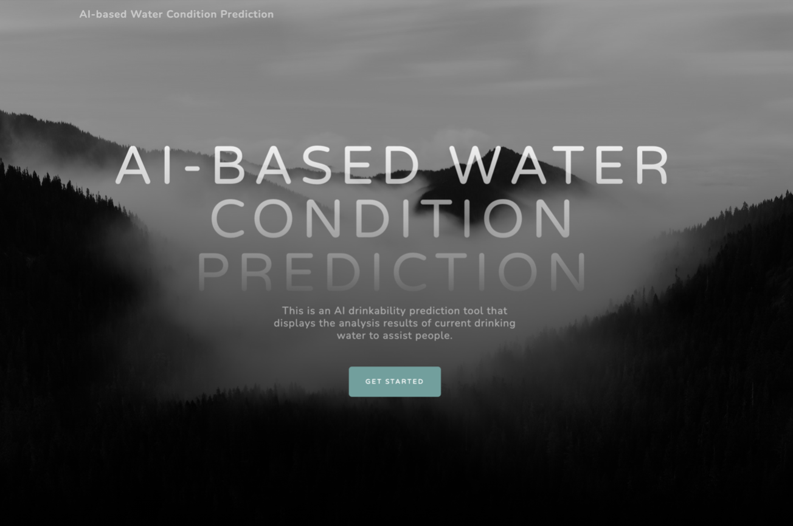
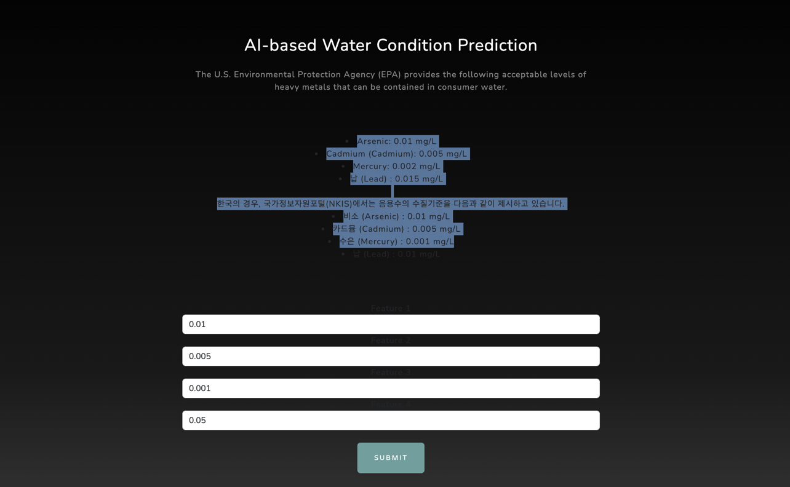
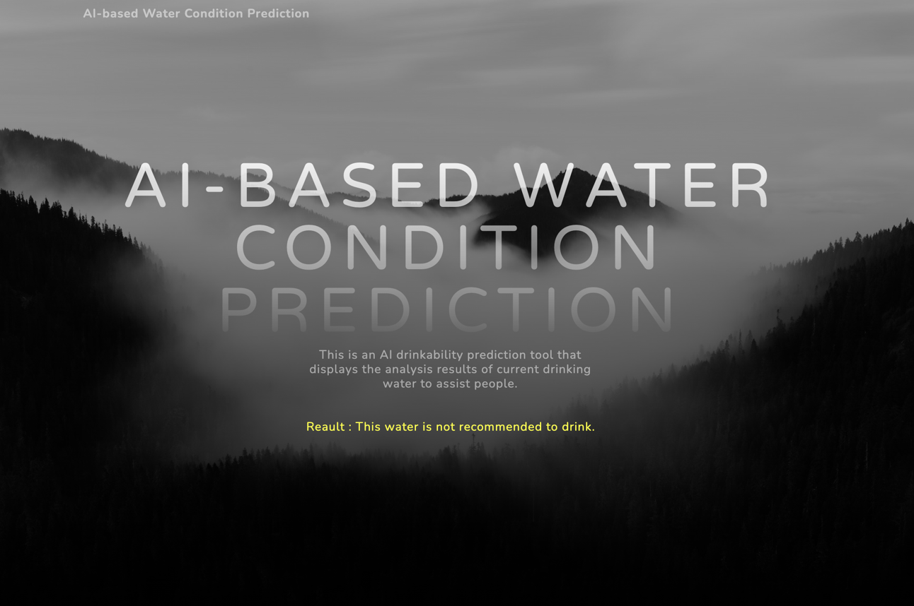
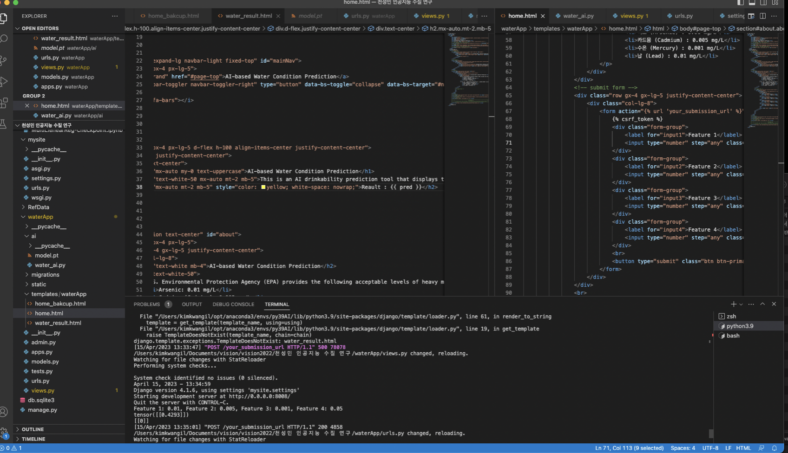

# Project Title

## Overview
This project is a web framework configured using Django, with the frontend created using Bootstrap. The core technology of the backend is an AI-based prediction function that predicts the safety of water based on user-inputted data.

이 프로젝트는 Django를 사용하여 구성된 웹 프레임워크로, 프론트엔드는 Bootstrap을 사용하여 생성되었습니다. 백엔드의 핵심 기술은 사용자가 입력한 데이터에 기반하여 물의 안전성을 예측하는 인공지능 기반 예측 기능입니다.

## Snap Shots





## Dependencies
1.Python </br>
2.Django </br>
3.Bootstrap </br>
4.PyTorch 

## How to Run 
To run the project, first set up a virtual environment and install the necessary dependencies. Then call the water_predict function using the WaterAnalysis class.

Run the Django development server:

python manage.py runserver

When you run the above command, the development server starts, and it hosts the web application on port 8000 by default. You can check that the Django application is running by connecting to http://localhost:8000/ on your browser.


프로젝트를 실행하려면, 먼저 가상환경을 구성하고, 필요한 종속성을 설치하세요. 
그 다음 WaterAnalysis 클래스를 사용하여 water_predict 함수를 호출합니다.

Django 개발 서버를 실행합니다:

```python manage.py runserver```

위의 명령어를 실행하면, 개발 서버가 시작되며, 기본적으로 8000번 포트에서 웹 애플리케이션을 호스팅합니다. 브라우저에서 http://localhost:8000/로 접속하면, Django 애플리케이션이 실행되는 것을 확인할 수 있습니다.


## Code Snippet
```python
import torch
import torch.nn as nn
import torch.optim as optim
import torch.nn.functional as F

import os
from django.conf import settings

# Define the model
class Model(nn.Module):
    def __init__(self):
        super().__init__()
        self.linear = nn.Linear(4, 1)

    def forward(self, x):
        return self.linear(x)

class WaterAnalysis():
    def __init__(self) -> None:
        pass

    def water_predict(self, f_1, f_2, f_3, f_4):
        # Create a new model object
        new_model = Model()

        # Load the saved model
        model_path = 'waterApp/ai/model.pt'
        new_model.load_state_dict(torch.load(model_path))

        # Predict with the loaded model
        with torch.no_grad():
            x_test = torch.FloatTensor([[f_1, f_2, f_3, f_4]])  # set x_test data
            y_test = new_model(x_test)
            print(y_test)

        # Convert the tensor to a NumPy array
        output_numpy = y_test.detach().numpy()

        # Set a threshold to convert the output to binary labels
        threshold = 0.5
        binary_label = (output_numpy > threshold).astype(int)

        print(binary_label)
        if binary_label == [[0]]:
            result = "This water is not recommended to drink."
        else:
            result = "This water is expected to be drinkable."

        return result

# Test
if __name__ == "__main__":
    main = WaterAnalysis()

    f_1 = 0.01
    f_2 = 0.005
    f_3 = 0.001
    f_4 = 0.015

    water_pred = main.water_predict(f_1, f_2, f_3, f_4)

    print(water_pred)
```

## License
This project is licensed under the MIT License.
이 프로젝트는 MIT 라이센스에 따라 라이센스가 부여됩니다.

